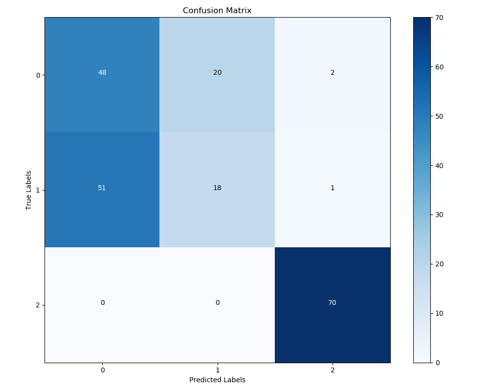
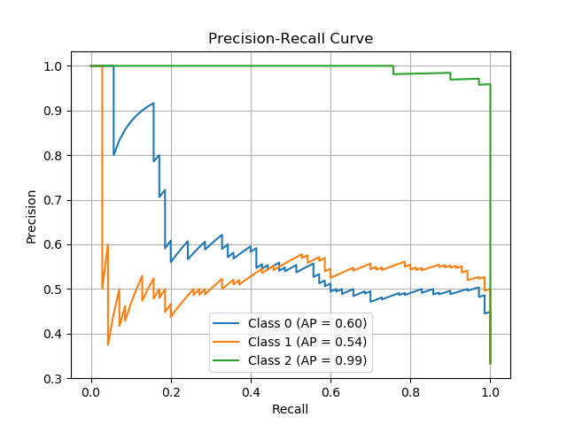

# Cough-Sense
A deep learning model for classification of coughs for the type of cause: bacterial, viral, or neither.

## Data
COUGhVID Dateset Link: https://www.kaggle.com/datasets/nasrulhakim86/coughvid-wav

TBScreen Dataset Link: https://zenodo.org/records/10431329

Take note the TBScreen dataset is a large file (395 GB)

Use the `create_dataset.py` file to set up the dataset. Make sure all file paths are adjusted. 

Use the `truncate_covid.py` file to reduce all covid audio lengths down to 1 second.

## Usage
For training, adjust file paths in `train.py`. 

For inference, adjust file paths in `inference.py` for model and audio sample.

## Results

